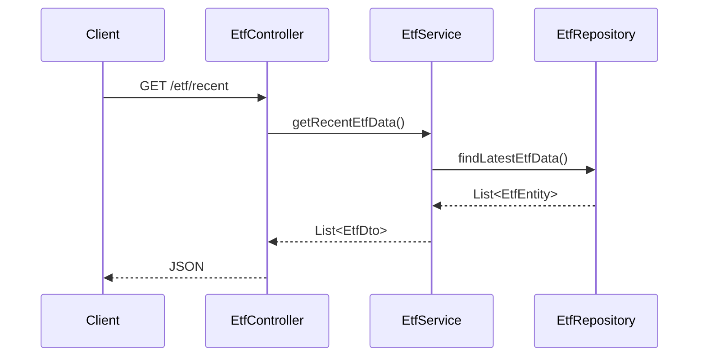
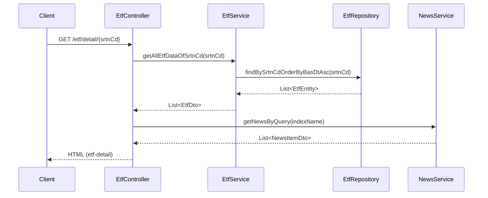
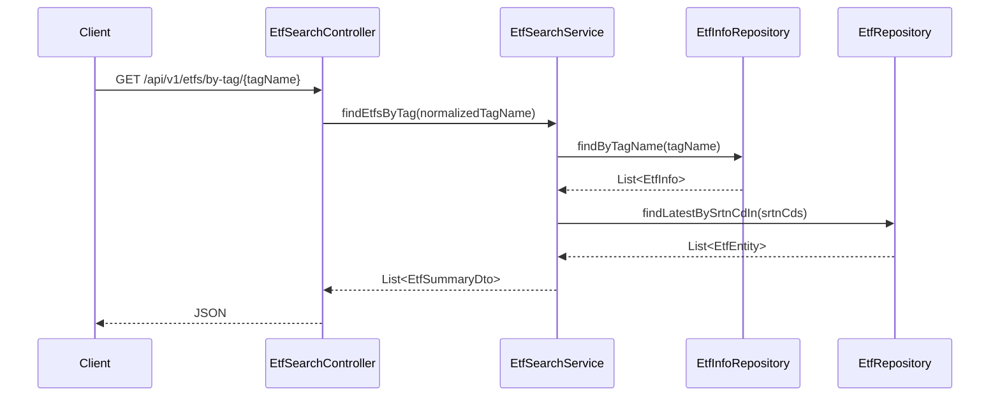
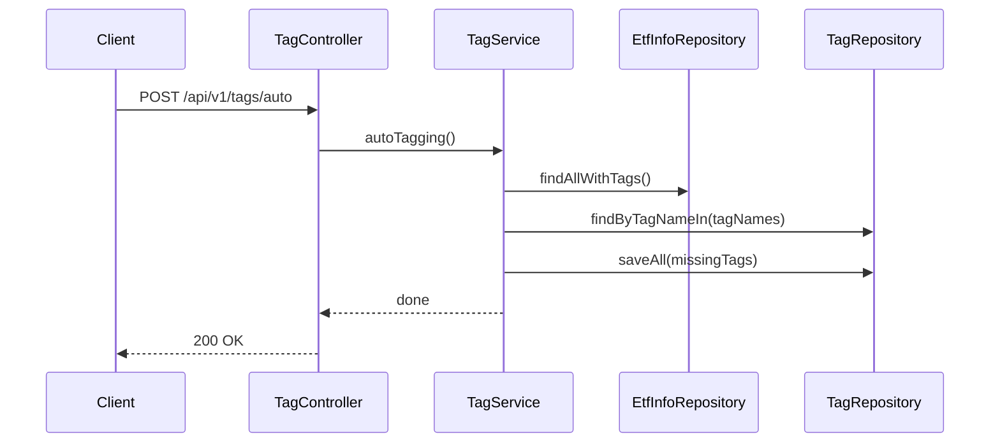
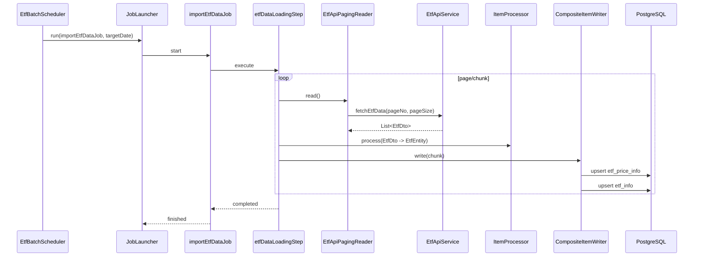
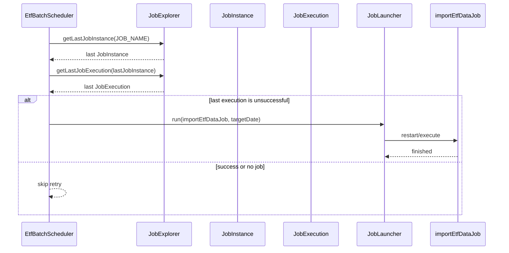

# 진격의 ETF

국내 상장 ETF 데이터를 수집·저장하고, 태그 기반으로 탐색/조회할 수 있는 Spring Boot 서비스입니다.

- 외부 데이터 수집: 공공데이터포털 ETF API
- 주기 실행: Spring Batch + Scheduler
- 조회 방식: REST API + Thymeleaf 화면
- 운영: Docker Compose, Nginx, Prometheus, Grafana

## 기술 스택

- Language: Java 17
- Framework: Spring Boot 3.4.x
- Build: Gradle
- DB: PostgreSQL
- ORM: Spring Data JPA (JPQL/Native Query 포함)
- Batch: Spring Batch
- View: Thymeleaf + Bootstrap + jQuery
- Test: JUnit 5, Spring Boot Test

## 프로젝트 구조

```text
src/
  main/
    java/com/newproject/etf/
      batch/        # 외부 API 페이징 리더
      config/       # Batch/WebClient/Scheduler 설정
      controller/   # API/페이지 컨트롤러
      dto/          # 응답/뷰 DTO
      entity/       # JPA 엔티티
      listener/     # 배치 완료 리스너
      mapper/       # Entity <-> DTO 변환
      repository/   # JPA Repository
      scheduler/    # 배치 스케줄러
      service/      # 비즈니스 로직
    resources/
      templates/    # Thymeleaf 화면
      static/       # css/js/images/favicon
      application.yml
      application-secret.yml.example
  test/
```

인프라 관련 디렉터리:

- `.github/workflows/deploy.yml`: CI/CD (build -> docker push -> EC2 deploy)
- `docker-compose.yml`: app/nginx/certbot/prometheus/grafana 구성
- `nginx/conf.d/app.conf`: 리버스 프록시 + SSL
- `prometheus/prometheus.yml`: Actuator metrics 수집

## 핵심 기능

### 1) ETF 데이터 수집/적재

- `EtfApiService`가 외부 ETF API 호출
- `EtfApiPagingReader`가 페이지 단위로 읽고 중복/이전 데이터 구간 제어
- `EtfBatchConfig`가 배치 Job/Step 구성
- 스케줄러가 주기 실행 및 실패 재시도

### 2) ETF 조회

- 최근 ETF 목록: `GET /etf/recent`
- ETF 상세 페이지: `GET /etf/detail/{srtnCd}`
- 단건 조회: `GET /etf/{date}/{name}`

### 3) 태그 기반 탐색

- 태그 목록: `GET /api/v1/tags`
- 태그별 ETF 목록: `GET /api/v1/etfs/by-tag/{tagName}`
- 자동 태깅 실행:
  - `POST /api/v1/tags/auto`
  - `POST /api/admin/tags/auto-tagging`

## 최근 반영된 개선 사항

### 태그 검색 성능 개선

- 기존: 태그별 ETF 조회 시 ETF마다 최신 가격 조회 (N+1 패턴)
- 개선: `srtnCd IN (...)` 기반으로 최신 가격 일괄 조회

### 자동 태깅 성능 개선

- 기존: 태그 존재 확인/생성을 ETF 반복 루프 내에서 수행
- 개선:
  - 태그 사전 로딩
  - 누락 태그 일괄 생성
  - ETF-태그 연관관계 사전 fetch

## 실행 방법

### 1) 사전 준비

- Java 17
- PostgreSQL

`src/main/resources/application-secret.yml` 파일을 준비합니다.

```yaml
secret:
  db:
    host: localhost
    port: 5432
    name: etf
    username: your_username
    password: your_password
  api:
    service-key: your_data_go_kr_service_key
```

`application-secret.yml.example`를 복사해서 사용하면 됩니다.

### 2) 로컬 실행

```bash
./gradlew bootRun
```

Windows:

```powershell
.\gradlew.bat bootRun
```

### 3) 테스트 실행

```bash
./gradlew test
```

## 관측/모니터링

- Actuator endpoint: `/actuator/health`, `/actuator/info`, `/actuator/prometheus`
- Prometheus가 app metrics를 scrape
- Grafana에서 대시보드 시각화

## 배포

GitHub Actions에서 `master` 푸시 시:

1. Gradle build
2. Docker image push (`yoontarget/etf:latest`)
3. EC2에서 `docker compose up -d`

배포 배지:


## API 예시

### 1) 최근 ETF 목록 조회

```http
GET /etf/recent
```

응답 예시:

```json
[
  {
    "basDt": "20260226",
    "srtnCd": "379800",
    "isinCd": "KR7379800006",
    "itmsNm": "KODEX 미국S&P500",
    "clpr": "21265",
    "vs": "-5",
    "fltRt": "-0.02",
    "nav": "21231.91",
    "mkp": "21190",
    "hipr": "21265",
    "lopr": "21165",
    "trqu": "2413104",
    "mrktTotAmt": "5382171500000",
    "bssIdxIdxNm": "S&P 500"
  }
]
```

### 2) ETF 상세 페이지 조회

```http
GET /etf/detail/{srtnCd}
```

- HTML(Thymeleaf) 페이지를 반환합니다.
- 내부적으로 종목 시계열 + 관련 뉴스를 함께 로드합니다.

### 3) 태그 목록 조회

```http
GET /api/v1/tags
```

응답 예시:

```json
[
  { "id": 1, "tagName": "#미국대표", "etfCount": 120 },
  { "id": 2, "tagName": "#반도체", "etfCount": 42 }
]
```

### 4) 태그별 ETF 조회

```http
GET /api/v1/etfs/by-tag/{tagName}
```

응답 예시:

```json
[
  {
    "srtnCd": "091160",
    "itmsNm": "KODEX 반도체",
    "clpr": 35000,
    "fltRt": 1.5,
    "vs": 520,
    "trqu": 1820000,
    "mrktTotAmt": 1300000000000,
    "tags": ["#반도체", "#미국대표"]
  }
]
```

### 5) 자동 태깅 실행

```http
POST /api/v1/tags/auto
POST /api/admin/tags/auto-tagging
```

응답 예시:

```json
"Auto-tagging completed successfully."
```

## 요청 흐름 시퀀스 다이어그램

### 1) `GET /etf/recent`



### 2) `GET /etf/detail/{srtnCd}`



### 3) `GET /api/v1/etfs/by-tag/{tagName}`



### 4) `POST /api/v1/tags/auto`



### 5) `importEtfDataJob` 배치 실행 흐름



### 6) `retryFailedJob` 재시도 흐름


